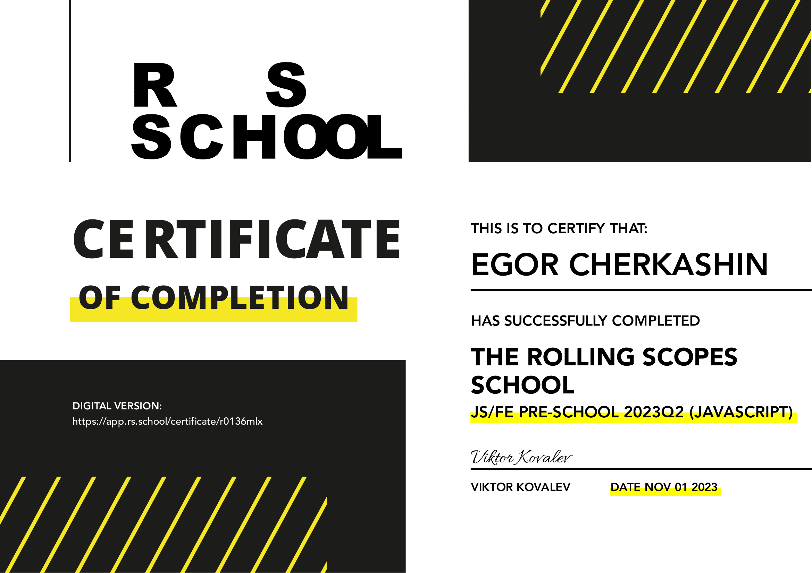
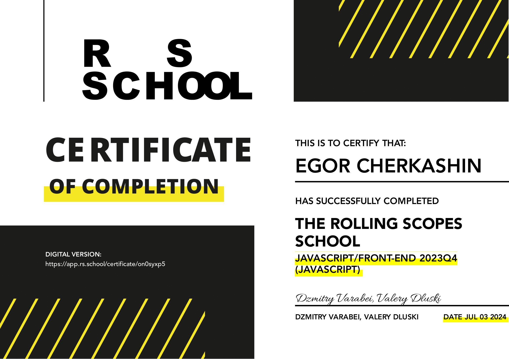

  

###

    <h1>Привет, Мир! 👋</h1>

### Меня зовут **Егор** и я фронтенд разработчик.
Ещё недавно я закончил Rolling Scopes School, а сейчас я готов к работе.

    

         
        
Stage 0

    

    

         
        
Stage 1-2

    

Вы можете связаться со мной:

    <h3>Технологии, изученные во время обучения:</h3>
    
    
    
    
    
    
    
    
    
    
    
    
    
    
    
    
    

Также я являюсь аспирантом СПб ФИЦ РАН

    <h3>В аспирантуре я работаю с:</h3>
    
    
    

###

<h3 align="left">🔥   Моя статистика :</h3>

  
  

